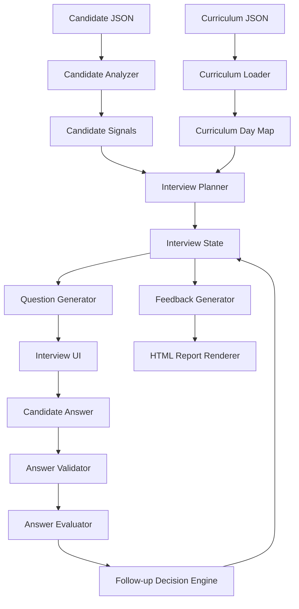

# InterviewOS Architecture

## Purpose

InterviewOS is an adaptive AI technical interviewer for AI Cohort graduates.

The application uses the provided curriculum and candidate profile JSON files to conduct a personalized interview, evaluate candidate answers, maintain session context, and generate a downloadable readiness report.

## System Overview



## Runtime Data Flow

```mermaid
flowchart LR
    A["data/candidates.json"] --> B["/api/candidates"]
    C["data/curriculum.json"] --> B
    B --> D["Candidate Dashboard"]
    D --> E["Selected Candidate"]
    E --> F["POST /api/interview"]
    F --> G["InterviewEngine.start"]
    G --> H["Session Plan"]
    H --> I["Question"]
    I --> J["Candidate Answer"]
    J --> K["InterviewEngine.turn"]
    K --> L["Validation + Scoring"]
    L --> M["Follow-up or Next Topic"]
    M --> N["Final Feedback"]
    N --> O["report_download.html"]
```



## Tech Stack

### Backend

- Flask for web routes, API endpoints, and template rendering.
- Pydantic for request validation.
- In-memory Python dictionaries for hackathon session state.
- JSON files as the source of truth for curriculum and candidate data.

### Frontend

- Vanilla HTML, CSS, and JavaScript.
- No frontend build step.
- Candidate dashboard and interview room rendered through Flask templates.

### Optional Media Layer

- Flask-SocketIO for interview-room signaling.
- WebRTC utilities for optional video room behavior.
- Sarvam AI utilities preserved for optional STT/TTS features.

The core hackathon flow is text-first and does not depend on voice or video.

## Core Product Flow

```text
/                          -> landing page
/dashboard                 -> candidate dashboard
/api/candidates             -> candidate list from JSON
/api/interview/create       -> creates interview room metadata
/interview/<room_id>        -> candidate-specific interview room
/api/interview              -> required adaptive interview API
/api/interview/<id>/report/download -> downloadable report
```

## Required Endpoint

### `POST /api/interview`

This is the main hackathon endpoint.

It supports two modes:

### 1. Start Interview

Request:

```json
{
  "sessionId": "CAND-001-ABCD",
  "candidate": {
    "id": "CAND-001"
  }
}
```

Behavior:

- finds the candidate profile
- analyzes the candidate journey
- creates an interview plan
- initializes session state
- returns the first question

### 2. Continue Interview

Request:

```json
{
  "sessionId": "CAND-001-ABCD",
  "message": "Candidate answer text"
}
```

Behavior:

- validates the answer
- rejects gibberish without advancing
- evaluates valid answers
- decides follow-up or next topic
- updates session memory
- returns next question or final feedback

## Directory Structure

```text
InterviewOS/
├── ai/
├── data/
├── models/
├── routes/
├── services/
├── static/
├── templates/
├── utils/
├── webrtc/
├── app.py
├── config.py
├── requirements.txt
├── README.md
├── ARCHITECTURE.md
├── PROMPTS.md
└── technical-spec.md
```

## Root Files

### `app.py`

Creates the Flask application, registers blueprints, configures Socket.IO, and starts the server.

### `config.py`

Stores app configuration such as host, port, debug mode, secret key, audio folder paths, optional Sarvam API key, and WebRTC STUN server config.

### `requirements.txt`

Lists Python dependencies needed to run the app.

### `README.md`

Judge-facing overview of the project, setup instructions, API contract, and demo flow.

### `ARCHITECTURE.md`

Explains the file structure, system design, and runtime flow.

### `PROMPTS.md`

AI usage log for hackathon authenticity review.

### `technical-spec.md`

Provided technical specification for the hackathon.

## Data Layer

### `data/curriculum.json`

Contains the 31-day AI Cohort curriculum.

Used for:

- curriculum day lookup
- module/topic mapping
- interview topic planning
- expected answer direction

### `data/candidates.json`

Contains synthetic candidate profiles.

Used for:

- dashboard cards
- candidate-specific interview planning
- completed/skipped/weak topic analysis

## Services

### `services/cohort_data.py`

Loads and maps cohort data.

Responsibilities:

- load curriculum JSON
- load candidate JSON
- find candidate by ID
- map curriculum days to modules/topics

Used by:

- `routes/interview_routes.py`
- `services/candidate_analyzer.py`
- `services/interview_engine.py`

### `services/candidate_analyzer.py`

Turns raw candidate data into interview planning signals.

Outputs include:

- completed days
- skipped days
- failed or weak days
- strong days
- difficulty level
- candidate summary

### `services/interview_engine.py`

Core interview logic.

Responsibilities:

- create `InterviewState`
- plan interview topics
- generate questions
- validate answers
- score answers
- decide follow-up vs next topic
- maintain transcript and evaluations
- generate final feedback

This file satisfies most of the hackathon requirements.

## Routes

### `routes/interview_routes.py`

Main product routes.

Important endpoints:

```text
GET  /dashboard
GET  /api/candidates
POST /api/interview
POST /api/interview/create
GET  /interview/<room_id>
GET  /api/interview/<room_id>/report/download
```

Also handles saving final feedback and enriched question-by-question report data.

### `routes/ai_routes.py`

Optional AI/voice-related routes from the interview-room layer.

The required text interview flow does not depend on this file.

## Models

### `models/interview.py`

In-memory interview store.

Stores:

- room ID
- candidate name
- candidate ID
- role
- answers
- report
- question-answer history
- status
- timestamps

This is intentionally lightweight because persistent user accounts and long-term history are out of scope.

## Templates

### `templates/index.html`

Landing page with product hero, dashboard preview, navigation, and responsive layout.

### `templates/dashboard.html`

Primary candidate dashboard and interview workspace.

Includes:

- candidate list
- profile summary
- candidate-specific interview room
- current question
- answer box
- optional media controls
- feedback panel
- download report button

### `templates/interview_room.html`

Legacy standalone room template with optional video/audio support.

### `templates/create_interview.html`

Legacy create-room page. It is not central to the main demo flow.

### `templates/report_download.html`

Downloadable HTML readiness report.

Includes:

- candidate name
- role/session
- questions answered
- curriculum days covered
- overall score
- summary
- strengths
- gaps
- next steps
- question-by-question analysis
- generated date/time
- print/save PDF support

## Static Files

### `static/js/interview.js`

Frontend interview loop.

Responsibilities:

- start interview
- send answers to `/api/interview`
- render questions
- update progress
- show invalid-answer retry messages
- display final feedback
- control report button visibility

### `static/js/audio.js`

Optional voice recording path. Voice transcript can be submitted into the same interview engine.

### `static/js/webrtc.js`

Optional media/video behavior.

### `static/js/socket.js`

Socket.IO helper for optional media room signaling.

### `static/css/dashboard.css`

Dashboard and interview workspace styling.

### `static/css/landing.css`

Landing page styling.

### `static/css/interview_room.css`

Standalone room styling.

### `static/css/style.css`

Legacy shared styles from the earlier interview-room prototype.

## Utils

### `utils/validation.py`

Pydantic request models.

Validates:

- interview start request
- interview turn request
- create-room request
- save-answers request

### `utils/sanitization.py`

Cleans AI-generated or user-provided text output.

### `utils/timer.py`

Timer helper retained from the interview-room layer.

### `utils/audio_recorder.py`

Optional audio helper.

## AI Layer

### `ai/stt_engine.py`

Optional speech-to-text helper.

### `ai/tts_engine.py`

Optional text-to-speech helper.

### `ai/question_engine.py`

Legacy generic question generator. Not used by the main adaptive `/api/interview` flow.

### `ai/report_engine.py`

Legacy generic report generator. Not used by the main readiness report flow.

## WebRTC Layer

### `webrtc/signaling.py`

Socket.IO events for optional browser media signaling.

### `webrtc/room_manager.py`

Tracks optional media room participants.

## Interview Engine Details

### Session State

Each interview is tracked by `sessionId`.

The session stores:

- candidate profile
- interview plan
- current topic index
- question count
- transcript
- evaluations
- last question
- completion status

### Answer Validation

The backend rejects empty answers, random gibberish, repeated meaningless text, and unusable responses.

The backend accepts but scores weakly uncertainty such as "I am not sure", partial technical answers, and vague answers with some relevant meaning.

### Scoring

Answer scoring considers:

- topic-specific keywords
- technical depth signals
- tradeoff/metric/evaluation language
- weak or vague wording
- uncertainty signals

Each answer receives:

- score
- understanding level
- strengths
- missing concepts
- expected answer direction

### Completion Logic

The interview completes after enough answered questions and enough planned curriculum coverage.

This prevents the interview from ending too early due to follow-up questions.

## Report Generation

When the interview completes:

1. final feedback is generated
2. transcript and evaluations are saved in memory
3. report download route renders `report_download.html`
4. browser downloads an HTML file
5. evaluator can print or save it as PDF

## Why Flask

Flask is appropriate for this hackathon because the API contract is small, the project is Python-based, templates avoid a frontend build step, JSON files are easy to load server-side, and fast local development/deployment is possible.

Using Flask reduced migration work and allowed more time for the adaptive interview logic.

## Design Choices

### Text-first interview

Voice and video are optional. The required flow works through text so judging does not depend on microphone permissions or external voice APIs.

### In-memory state

Persistent accounts and long-term history are out of scope, so in-memory session state is enough for the demo.

### Deterministic scoring

The interview engine uses transparent scoring rules instead of relying fully on an external model. This keeps the demo reliable even with limited API access.

### HTML report

The downloadable report is HTML because it is easy to style, inspect, download, and save as PDF from the browser.

## Attribution

InterviewOS was built during the hackathon by extending a pre-existing Flask interview-room prototype that included optional audio/video utilities. The adaptive interview engine, curriculum and candidate JSON integration, candidate dashboard, answer validation, scoring, feedback generation, and downloadable readiness report were implemented for this hackathon.
