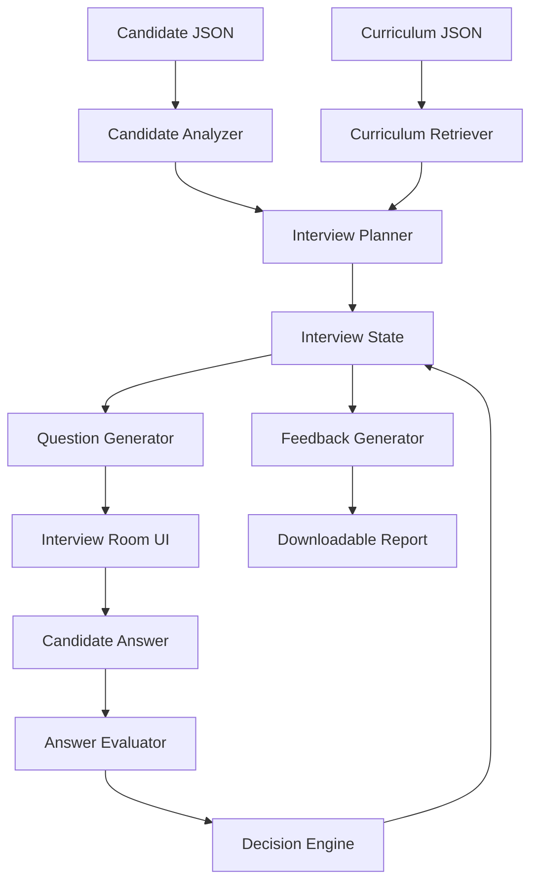

# InterviewOS

Adaptive AI technical interviewer for AI Cohort graduates.

## Problem

AI Cohort learners complete 31 days of work across RAG, vector databases, prompt engineering, agents, MCP, deployment, and production AI systems. The hard part is explaining what they built and defending the engineering decisions in a realistic interview.

## Solution

InterviewOS turns a learner's cohort journey into an adaptive technical interview. It analyzes the candidate profile, retrieves relevant curriculum days, plans a personalized interview, asks follow-up questions based on answers, maintains session memory, and generates a structured readiness report.

## Features

- Candidate dashboard generated from `data/candidates.json`
- Curriculum-grounded questions from `data/curriculum.json`
- Required `POST /api/interview` endpoint
- Session memory keyed by `sessionId`
- 10-question adaptive interview flow
- Follow-up questions based on previous answers
- At least 4 curriculum days covered per interview
- Structured final feedback with `summary`, `strengths`, `gaps`, and `next`
- Downloadable AI Engineering Readiness Report
- Existing VivaAI video, microphone, STT, and TTS layers preserved as optional enhancements

## Architecture



## API Contract

### Start Interview

```http
POST /api/interview
```

```json
{
  "sessionId": "abc-123",
  "candidate": { "id": "CAND-001" }
}
```

### Conversation Turn

```json
{
  "sessionId": "abc-123",
  "message": "I would evaluate retrieval quality using recall, precision, reranking, and traces."
}
```

### Final Response

```json
{
  "reply": "Interview completed.",
  "done": true,
  "feedback": {
    "summary": "...",
    "strengths": [],
    "gaps": [],
    "next": []
  }
}
```

## Tech Stack

- Flask
- Flask-SocketIO
- SQLite
- Vanilla HTML/CSS/JavaScript
- Sarvam AI integrations retained for optional voice/STT features

## Run Locally

```bash
pip install -r requirements.txt
python app.py
```

Open:

```text
http://localhost:5000
```

## Demo Flow

1. Open the landing page.
2. Select a candidate from the dashboard.
3. Start the interview room.
4. Answer 10 adaptive technical questions.
5. View the structured final report.
6. Download the readiness report.

## Key Design Choice

The product is not a static question bank. The backend controls the interview state and uses a deterministic decision engine:

```text
answer -> evaluation -> decision -> follow-up or next topic -> updated memory
```

This keeps the demo reliable while still feeling like a realistic technical interview.

## AI Usage

See `PROMPTS.md`.
